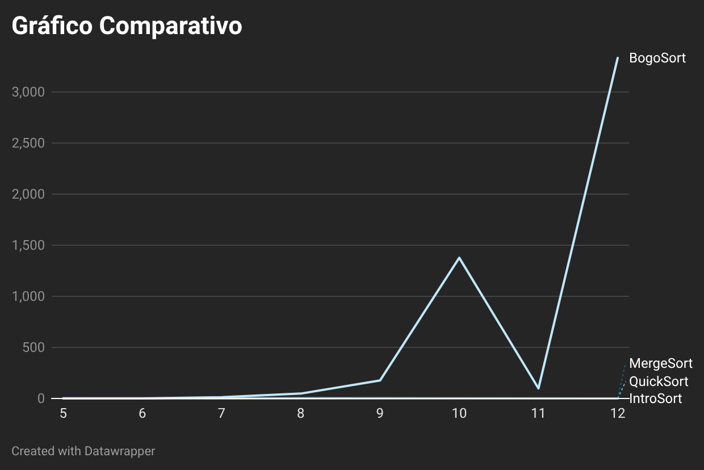

# Análise Teórica: Bogo Sort 

## 1. Introdução e Inspiração
* **O Algoritmo:** O Bogo Sort (também conhecido como *Stupid Sort* ou *Monkey Sort*) é um algoritmo de ordenação "meme", baseado no paradigma de "gerar e testar". 
* **Inspiração Teórica:** A sua grande inspiração teórica é o **Teorema do Macaco Infinito**, que sugere que um macaco digitando aleatoriamente em um teclado por um tempo infinito eventualmente produzirá um texto com sentido. No caso do algoritmo, ele embaralha os elementos do vetor aleatoriamente e verifica se ficaram ordenados. Se não, embaralha tudo de novo.
* **Origem e Nome:** Surgiu na comunidade acadêmica de computação, possivelmente na Carnegie Mellon University (CMU) entre as décadas de 1970 e 1980. O termo *Bogo Sort* vem da junção das palavras inglesas *"bogus"* (falso, ruim, sem sentido) e *"sort"* (ordenação).

---

## 2. Variante
* **Independência:** O Bogo Sort não é uma variante de nenhum algoritmo tradicional de ordenação. Trata-se de um algoritmo independente que utiliza embaralhamentos aleatórios para tentar encontrar uma sequência ordenada. 
* **Derivados:** Apesar disso, existem algoritmos derivados dele, como o **Bozo Sort**, que segue a mesma filosofia baseada em aleatoriedade (porém, em vez de embaralhar tudo, escolhe apenas dois elementos aleatórios e troca-os de lugar repetidamente).

---
## 3. Matriz de Complexidade Assintótica

| Algoritmo | Melhor Caso | Caso Médio | Pior Caso | Espaço Auxiliar | Estabilidade | In-Place |
| :--- | :--- | :--- | :--- | :--- | :--- | :--- |
| **Bogo Sort** | $O(n)$ | $O(n \cdot n!)$ | $O(\infty)$ | $O(1)$ | Instável | Sim |

* **Melhor Caso $O(n)$:** Ocorre se o vetor já for entregue totalmente ordenado. Faz apenas uma verificação e para.
* **Caso Médio $O(n \cdot n!)$:** A probabilidade de acertar na permutação correta por pura sorte exige um número gigantesco de tentativas, tornando-o inviável.
* **Pior Caso $O(\infty)$:** Como o embaralhamento é aleatório e sem memória, teoricamente ele pode rodar ao infinito sem nunca acertar a ordem.

---

## 4. Propriedades Técnicas do Algoritmo

* **In-Place:** **Sim.** O algoritmo reorganiza os elementos dentro do próprio vetor original, utilizando uma quantidade mínima e constante de memória extra $O(1)$.
* **Estabilidade:** **Não Estável.** O processo de embaralhamento rearranja as posições de forma totalmente aleatória, sem garantia de manter a ordem original de chaves idênticas.
* **Adaptativo:** **Não.** O algoritmo não aprende com as iterações passadas nem tira partido de subvetores já ordenados.

---

## 5. Limitações e Aplicações
O Bogo Sort possui utilidade prática nula em sistemas comerciais. No entanto, é uma excelente ferramenta:
* Para ilustrar graficamente o impacto catastrófico de uma complexidade fatorial nas aulas de Estruturas de Dados.
* Para atuar como teste de estresse (*benchmark*) extremo em processadores.

##  Implementação em JAVA

``` java
package bogosort;

import java.util.Random;

public class BogoSort {
    public static void sort(int[] v) {
        if (v == null || v.length <= 1) return;

        Random rand = new Random();
        boolean ordenado = false;

        while (!ordenado) {

            ordenado = true;
            for (int i = 1; i < v.length; i++) {
                if (v[i] < v[i - 1]) {
                    ordenado = false;
                    break;
                }
            }

            if (!ordenado) {
                for (int i = 0; i < v.length; i++) {
                    int randomIndex = rand.nextInt(v.length);
                    int temp = v[i];
                    v[i] = v[randomIndex];
                    v[randomIndex] = temp;
                }
            }
        }
    }
}
```
---

## 6. Comparativo Empírico de Desempenho

Atendendo aos requisitos do trabalho, realizamos testes práticos comparando os dois algoritmos pesquisados (**IntroSort** e **BogoSort**) com dois algoritmos já vistos em sala de aula (**MergeSort** e **QuickSort**). 

Os testes foram executados utilizando sequências de números totalmente aleatórios. Devido à limitação drástica de desempenho do BogoSort, o escopo de amostragem foi fixado em vetores de tamanho reduzido ($N = 5$ a $N = 12$).

A tabela abaixo consolida os tempos de execução (em milissegundos) obtidos para cada algoritmo:

| Tamanho do Vetor ($N$) | MergeSort (ms) | QuickSort (ms) | IntroSort (ms) | BogoSort (ms) |
| :---: | :---: | :---: | :---: | :---: |
| **5** | 1 | 0 | 0 | 1 |
| **6** | 0 | 0 | 0 | 1 |
| **7** | 1 | 0 | 1 | 13 |
| **8** | 4 | 1 | 1 | 48 |
| **9** | 3 | 1 | 1 | 176 |
| **10** | 1 | 2 | 0 | 1376 |
| **11** | 1 | 0 | 1 | 99 |
| **12** | 1 | 0 | 0 | 3331 |
=

O gráfico abaixo demonstra o crescimento do tempo de execução do BogoSort mesmo em vetores minúsculos (N de 5 a 12), evidenciando a sua ineficiência prática:



---

## 6. Conclusão

O BogoSort, como demonstrado no seu respetivo gráfico comparativo, atua apenas como uma prova de conceito académica. A sua ineficiência é severa: enquanto o MergeSort, QuickSort e IntroSort processam vetores de tamanho 12 em cerca de 0 milissegundos, o BogoSort sofre uma explosão combinatória, levando milhares de milissegundos para o mesmo volume de dados devido à sua natureza probabilística e complexidade de pior caso $O(\infty)$.