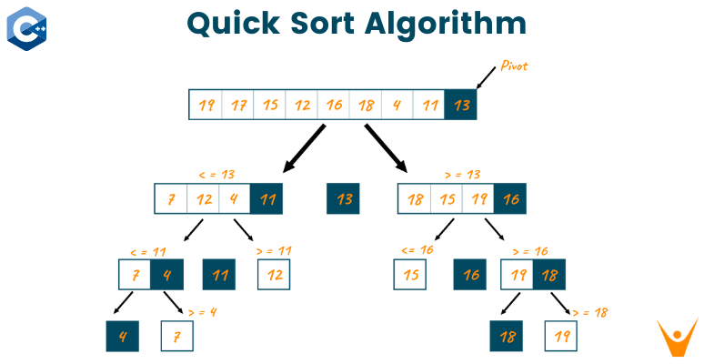
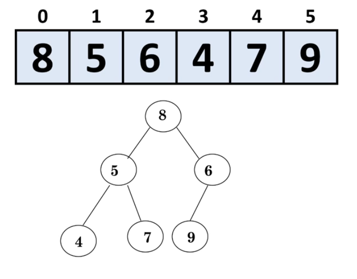
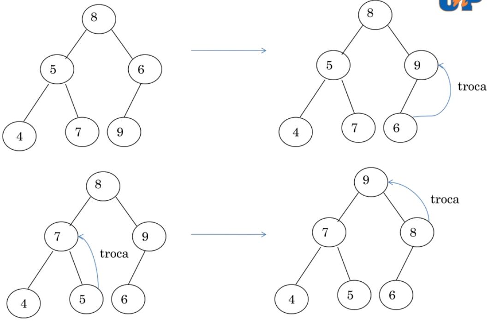
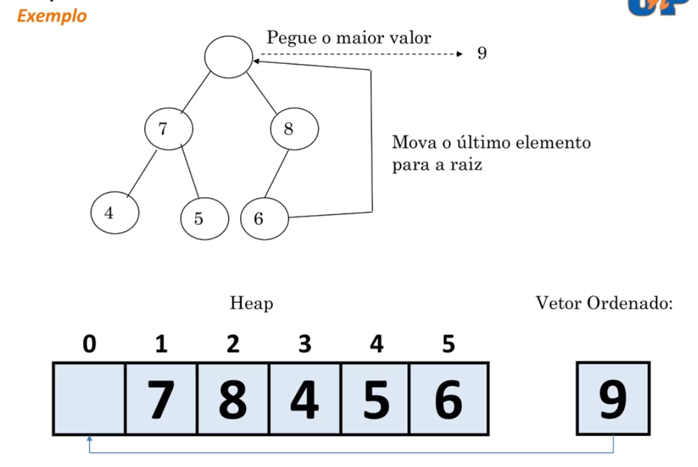
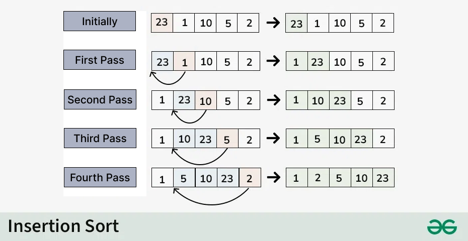

# Análise Comparativa: IntroSort e seus Pares Algorítmicos

# 1. Introdução
## Visão Geral e Características do IntroSort
### 1. Origem e Contexto Histórico
* **Quando foi criado:** Em 1997.
* **Por quem:** Desenvolvido pelo cientista da computação **David Musser**.
* **Motivo da criação:** Surgiu com o propósito de fornecer algoritmos genéricos e robustos para a **Biblioteca Padrão do C++** (STL). O objetivo era atender a requisitos de desempenho extremamente rigorosos e previsíveis, eliminando os gargalos dos algoritmos tradicionais da época.

---

## 2. Foco e Proposta do Algoritmo
O IntroSort é um algoritmo **híbrido por comparação** projetado para extrair o melhor de três mundos: o desempenho prático veloz do *QuickSort*, a blindagem contra o pior caso do *HeapSort* e a eficiência mecânica do *Insertion Sort*.

* **Complexidade no Pior Caso:** $O(n \log n)$ — Garantido pelo HeapSort.
* **Complexidade Média:** $O(n \log n)$ — Mantido pelo QuickSort.
* **Otimização:** Sim, o algoritmo é considerado ótimo por não degradar para $O(n^2)$ em nenhuma entrada de dados.

---

## 3. Como é Utilizado Hoje em Dia
Por conta de sua alta resiliência e velocidade, o IntroSort tornou-se o padrão da indústria para ordenação de propósito geral. Ele é a fundação do método `std::sort` na biblioteca padrão do C++ (como a `libstdc++` do GCC), protegendo sistemas comerciais e servidores contra trechos de dados maliciosos que tentam forçar o pior cenário de execução.

---

## 4. Explicação de Conceitos Técnicos Críticos

Para compreender o comportamento do IntroSort na memória, é necessário entender duas propriedades fundamentais que ele possui:

### A. O que é um Algoritmo In-Place?
Um algoritmo é considerado **in-place** (ou *em linha/no local*) quando ele reorganiza os elementos **dentro do próprio vetor original**, utilizando uma quantidade mínima e constante de memória extra apenas para variáveis auxiliares.

> **Na prática:** O IntroSort não precisa duplicar o array ou criar grandes estruturas na memória RAM para fazer a ordenação (ao contrário do *MergeSort*, que exige um vetor temporário do mesmo tamanho do original). O espaço extra que ele consome é restrito à pilha de chamadas da recursão ($O(\log n)$).

### B. O que é um Algoritmo Não Estável?
A **estabilidade** diz respeito à preservação da ordem original de elementos que possuem chaves com valores idênticos. Como o IntroSort é **não estável** (ou instável), ele **não garante** que essa ordem será mantida.

> **Exemplo Prático:** Imagine que você tem uma lista de alunos ordenada por ordem alfabética e decide reordená-los pela nota do trabalho usando o IntroSort:
> * Se o Aluno A e o Aluno B tiraram a mesma nota `7.0`, o algoritmo pode inverter a posição deles durante as trocas físicas (*swaps*) do QuickSort ou HeapSort.
> * Ao final da ordenação, o Aluno B pode aparecer antes do Aluno A na lista, quebrando a ordem alfabética secundária que existia antes.troSort resolve esse problema através de uma **estratégia híbrida de três fases**, que monitora o estado da recursão e o tamanho dos dados em tempo real para acionar a sub-rotina ideal:
---
## FUNCIONAMENTO DO INTRO SORT
```
               [ Array de Entrada ]
                       │
                       ▼
              ┌─────────────────┐
              │    QuickSort    │◄────────┐
              └────────┬────────┘         │ (Subarrays grandes
                       │                  │  & profundidade < limite)
             Se tamanho ≤ 16?
            ───────┬───────┘
                   │
         Sim       │       Não
  ┌────────────────┴┐     ┌───────────────────────┐
  │  InsertionSort  │     │ Profundidade ≥ Limite?│
  └─────────────────┘     └───────────┬───────────┘
                                      │
                            Sim       │       Não
                     ┌────────────────┴┐     ┌────────────────┐
                     │    HeapSort     │     │ Particionar e  │
                     └─────────────────┘     │ Fazer Recursão │
                                             └────────────────┘
```

## 2. Matriz de Comparação Assintótica

A tabela abaixo resume as diferenças de complexidade e propriedades entre o IntroSort e os algoritmos que orbitam sua estrutura:

| Algoritmo | Melhor Caso | Caso Médio | Pior Caso | Espaço Auxiliar | Estabilidade | In-Place |
| :--- | :--- | :--- | :--- | :--- | :--- | :--- |
| **IntroSort** | $O(n \log n)$ | $O(n \log n)$ | $O(n \log n)$ | $O(\log n)$ | Instável | Sim |
| **QuickSort** | $O(n \log n)$ | $O(n \log n)$ | $O(n^2)$ | $O(\log n)$ | Instável | Sim |
| **HeapSort** | $O(n \log n)$ | $O(n \log n)$ | $O(n \log n)$ | $O(1)$ | Instável | Sim |
| **Insertion Sort**| $O(n)$ | $O(n^2)$ | $O(n^2)$ | $O(1)$ | Estável | Sim |
| **Bogo Sort** | $O(n)$ | $O(n \cdot n!)$ | $O(\infty)$ | $O(1)$ | Instável | Sim |

---

## 3. Confrontos Diretos

### 🤝 IntroSort vs. QuickSort: A Correção do Pior Caso
* **A Herança:** O IntroSort utiliza o QuickSort como seu motor principal. Em cenários de partições equilibradas (caso médio), ambos apresentam o mesmo desempenho prático.
* **A Rede de Segurança:** O QuickSort clássico degrada para $O(n^2)$ diante de pivôs ruins (comum em arrays já ordenados ou inversamente ordenados). O IntroSort mitiga isso monitorando a profundidade da pilha de recursão. Se o limite de $2 \times \lfloor\log_2 n\rfloor$ for atingido, ele aborta o QuickSort e migra para o HeapSort.
* **Política de Pivô:** Enquanto o QuickSort aceita abordagens mais simples (como escolher o primeiro ou o último elemento), o IntroSort padroniza a técnica de **mediana de três** (início, meio e fim), neutralizando os piores casos mais comuns sem custos computacionais elevados.
  
### 🛡️ IntroSort vs. HeapSort: Garantia Teórica vs. Prática
* **A Válvula de Escape:** O HeapSort garante $O(n \log n)$ em qualquer cenário, mas perde em velocidade para o QuickSort na maioria das arquiteturas modernas. No IntroSort, o HeapSort atua como uma "válvula de segurança" ativada estritamente quando necessário.
* **A Questão da Memória:** O HeapSort é superior no consumo de memória auxiliar ($O(1)$ estrito), enquanto o IntroSort necessita de $O(\log n)$ devido à pilha de chamadas.
* **Localidade de Cache:** O HeapSort realiza varreduras não sequenciais no array (saltos de índices $k \to 2k+1$), gerando altas taxas de *cache miss*. O IntroSort, operando majoritariamente via QuickSort em segmentos contíguos, otimiza a hierarquia de cache do hardware moderno e entrega maior vazão (*throughput*).
  
  
  

### ⚡ IntroSort vs. Insertion Sort: O Limiar de Eficiência (N ≤ 16)
* **O Problema da Divisão e Conquista:** Algoritmos como o QuickSort possuem um custo operacional fixo (*overhead* de frames de pilha, cálculo de índices). Em conjuntos muito pequenos, esse custo supera o trabalho real de ordenação.
* **A Integração Perfeita:** Em subarrays com tamanho inferior ou igual a **16 elementos**, o IntroSort desvia a execução para o **Insertion Sort**. Embora assintoticamente pior no longo prazo ($O(n^2)$), o Insertion Sort possui as menores constantes reais e se aproxima de $O(n)$ para trechos quase ordenados, tornando-se imbatível nessa escala compacta.

  
---

## 4. Conclusão

O IntroSort consolida-se não apenas como uma evolução teórica, mas como uma **solução de engenharia de software aplicada**. Em vez de competir com os algoritmos clássicos, ele os integra de forma orquestrada, extraindo o potencial máximo de cada um em suas respectivas zonas de excelência:

* Do **QuickSort**, absorve-se a velocidade do caso médio e a eficiência de cache;
* Do **HeapSort**, adota-se a imunidade contra piores casos catastróficos;
* Do **Insertion Sort**, captura-se a agilidade mecânica para volumes microscópicos de dados.

> **Impacto na Indústria:** É devido a essa resiliência contra "entradas patológicas" e ataques de negação de serviço (focados em induzir piores casos de ordenação) que o IntroSort foi adotado como padrão em bibliotecas universais, a exemplo do `std::sort` na biblioteca padrão do C++ (GCC/libstdc++).

## 5. Referências e Fontes

* **QUINTILIANO, André.** *Ordenação de Dados - HeapSort*. Disponível em material didático/videoaula no Youtube.
* **INTROSORT.** In: WIKIPEDIA, a enciclopédia livre. Flórida: Wikimedia Foundation, 2026. Disponível em: <https://en.wikipedia.org/wiki/Introsort>. Acesso em: 2026.
* **SAS DO BIG SAS.** *Método de ordenação Introsort*. Disponível no Youtube.
* **NAPOLEÃO JR., Prof. Rogério.** *RESOLVENDO LEETCODE - 643. Maximum Average Subarray I - DESAFIO LEETCODE 75 - JAVA*. Disponível no Youtube.
* **RODRIGUES, Givanaldo.** *Repositório da Disciplina: Estruturas de Dados (2026)*. Disponível em: <https://github.com/givanaldo/estruturasdedados-2026>. Acesso em: 2026.
